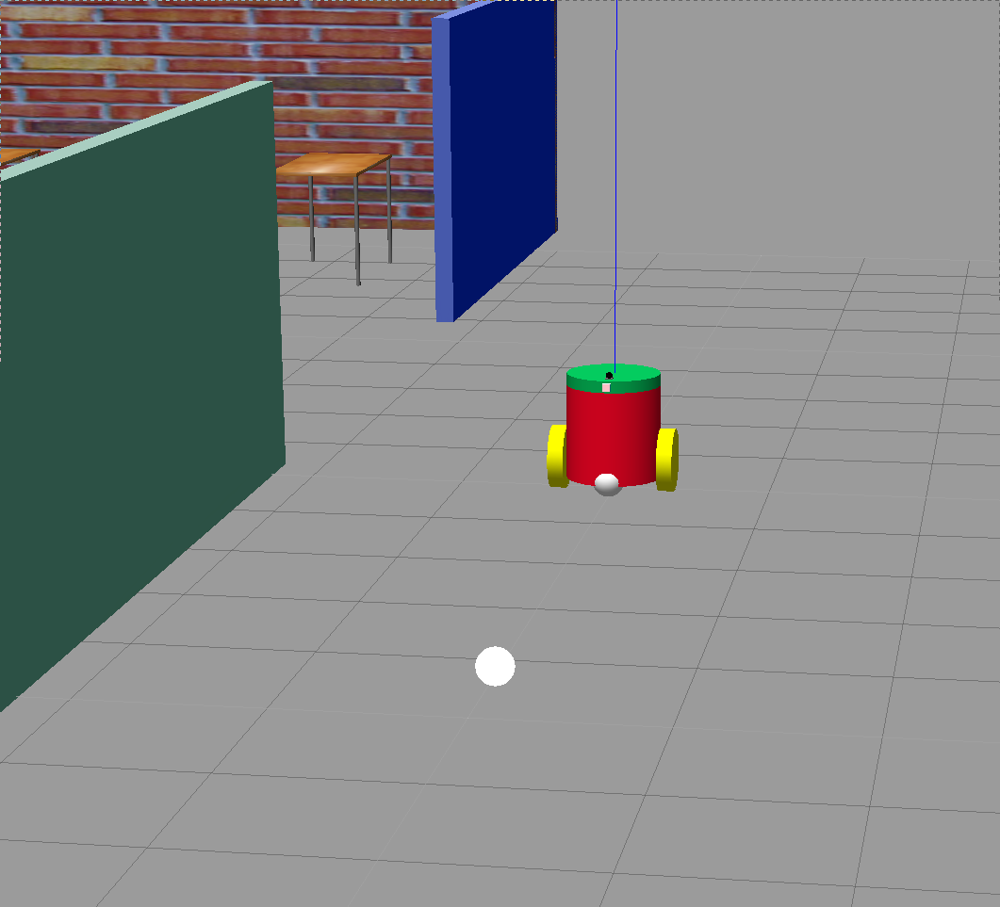

[](https://www.udacity.com/robotics)


# Go Chase It! - Project 2 of the Udacity Robotics Software Engineer Nanodegree

## Description

This project contains:
1. Robot that:
    - is housed in the world created in [Build My World](https://github.com/ChrisProgramming2018/robotic-projects/tree/master/Project_1_BuildMyWorld "RoboND Project-1")
    - is equiped with a camera and a lidar
2. White ball that will be chased by the robot
3. C++ source code of nodes that will command the robot to chase the ball, in the case the camera is seeing the ball.

Feature in case the ball its not found the robot will scan surroundings until ball is found

### Robot
- Front camera
- Lidar (hokuyo)

### Nodes

1.`drive_bot`
service `/ball_chaser/command_robot`
`drive_bot` publishes the right `geometry_msgs/Twist` message to the `differential_drive_controller'

2.`process_image` scans raw images published by the camera (it subscribes to topic `/camera/rgb/image_raw`) extract the ball position 

   

were moved from `process_image` to `chase_ball` in order to isolate the decision/command process from the environment analysis (processing of the image).

### Behaviour

1. Ball is seen by camera
   In this case, the robot will drive towards the ball, turning left of right based on the position of the ball in the image.


  When the robot is close enough to the ball, it will stop approaching.


2. Ball is not seen by the camera
   Robot starts rotating to scan its surroundings.
   Until the robot finds the ball then it will start chasing the ball again (as in 1).
      
      
## Instructions

1. Clone the repository

```git
git clone https://github.com/ChrisProgramming2018/robotic-projects.git
```
```
* Launch robot in Gazebo to load both the world and plugins  
```
roslaunch my_robot world.launch
```  

```  
* Launch ball_chaser and process_image nodes  
```
source devel/setup.bash
roslaunch ball_chaser ball_chaser.launch


## Project Description  
Directory Structure  
```
.Go-Chase-It                                   # Go Chase It Project
├── catkin_ws                                  # Catkin workspace
│   ├── src
│   │   ├── ball_chaser                        # ball_chaser package        
│   │   │   ├── launch                         # launch folder for launch files
│   │   │   │   ├── ball_chaser.launch
│   │   │   ├── src                            # source folder for C++ scripts
│   │   │   │   ├── drive_bot.cpp
│   │   │   │   ├── process_images.cpp
│   │   │   ├── srv                            # service folder for ROS services
│   │   │   │   ├── DriveToTarget.srv
│   │   │   ├── CMakeLists.txt                 # compiler instructions
│   │   │   ├── package.xml                    # package info
│   │   ├── my_robot                           # my_robot package        
│   │   │   ├── launch                         # launch folder for launch files   
│   │   │   │   ├── robot_description.launch
│   │   │   │   ├── world.launch
│   │   │   ├── meshes                         # meshes folder for sensors
│   │   │   │   ├── hokuyo.dae
│   │   │   ├── urdf                           # urdf folder for xarco files
│   │   │   │   ├── my_robot.gazebo
│   │   │   │   ├── my_robot.xacro
│   │   │   ├── world                         # world folder for world files
│   │   │   │   ├── chris.world
│   │   │   ├── CMakeLists.txt                 # compiler instructions
│   │   │   ├── package.xml                    # package info
│   ├── Robot.png
```

## Future improvements

- Search for the ball in the world  
