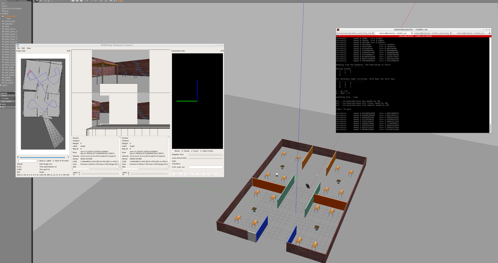

# Map My World
In this Project I used the  Real-Time Appearance Based Mapping (RTAB-Map) in ROS to perform SLAM . See the writeup for an extended discussion of the theoretical content on SLAM algorithms and specifics of RTAB-Map.

## Installation & Build
### ROS Kinetic
In the VM  LUbuntu 16.04 LTS with [ROS Kinetic](http://wiki.ros.org/kinetic), [Gazebo](http://gazebosim.org/) and [catkin](http://wiki.ros.org/catkin) installed.

### Dependencies
First upgrade the system ``update`` and ``upgrade``. Root rights are needed ``sudo``
The robot relies on the ``rtabmap_ros`` ROS package, which should be installed through ``apt-get``.

### Building the Workspace
Use ``catkin`` to build the packages from source. From the ``catkin`` workspace where you cloned the repo, run:

``catkin_make; source devel/setup.bash``

to build the workspace packages and add them to the paths of ROS.

### Running the Scripts
After the above steps, you should be able to run the commands below in separate terminals:

Launch the world in Gazebo:

``roslaunch my_robot chris_world.launch``

Launch the teleop node for keyboard control:

``teleop_twist_keyboard teleop_twist_keyboard.py  ``

Launch the RTAB-Map mapping node

``roslaunch my_robot mapping.launch``

### Tasks
There are two tasks involved in this project: robot model configuration and ``rtabmap`` for SLAM.
#### Robot Model Configuration
The model is modifed with an RGB-D camera to input depth information to RTAB-Map.

#### ``rtabmap`` for SLAM
The robot uses the information from the odometer, the RGB-D camera and the laser rangefinder to perform SLAM in the designated environment through ``rtabmap``. The ``rtabmap`` library produces map database files that can be read by its own visualization tools. Details of the algorithm can be found in the writeup. Here is an image of the reconstructed kitchen dining environment:

